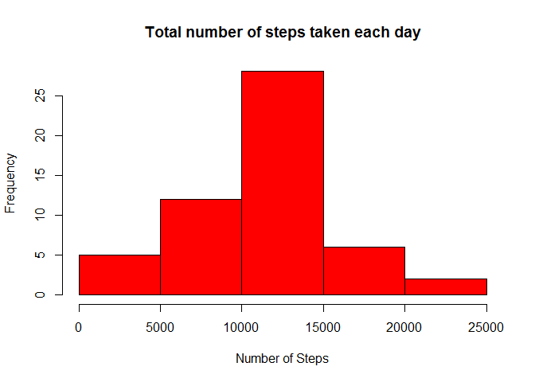
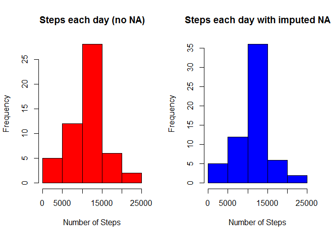
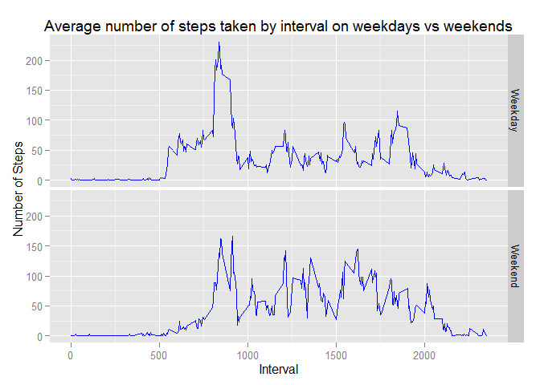

# Reproducible Research: Peer Assessment 1


## Loading and preprocessing the data

We load the data and we process/transform the data into a format suitable for your analysis


```r
## we set global options to show only 2 decimals
options(scipen = 1, digits = 2)

#  We check if we have the Dataset for the course project
#  otherwise We download the ZIP file and unZIP it at the working Directory

if (!file.exists("activity.csv")) {
  fileUrl <- "http://d396qusza40orc.cloudfront.net/repdata%2Fdata%2Factivity.zip"
  download.file(fileUrl, destfile = "./activity.zip", mode="wb" )
  unzip("activity.zip")
}
  activity <- read.csv("activity.csv",sep=",")

  activity$date <- as.Date(activity$date)
```


## What is mean total number of steps taken per day?


1) We calculate the total number of steps taken per day

```r
library(dplyr)
## We calculate the total of steps by day
total_steps_by_day <- summarise(group_by(activity,date ), total_steps=sum(steps))
```

2) We make a histogram of the total number of steps taken each day


```r
## We make a histogram of the steps by day
hist(total_steps_by_day$total_steps, main = "Total number of steps taken each day", col="red", xlab="Number of Steps")
```

 


3)  We calculate the mean and the median  steps taken per day


```r
## We calculate the mean and the median
mean_steps <- mean(total_steps_by_day$total_steps, na.rm=TRUE)
median_steps <- median(total_steps_by_day$total_steps, na.rm=TRUE)
```

The mean steps taken per day is **10766.19** and the median steps taken per day is  **10765**


## What is the average daily activity pattern?

1)  We Make a time series plot  of the 5-minute interval (x-axis) and the average number of steps taken, averaged across all days (y-axis)


```r
library(ggplot2)

## We group by interval all the steps
avg_steps_by_interval <- summarise(group_by(activity,interval), avg_steps=mean(steps, na.rm=TRUE))

## We plot the time series 

g <- ggplot(avg_steps_by_interval, aes(interval,avg_steps)) 
g <- g + geom_line(color="blue") + xlab("Interval") + ylab("Total Steps") + labs(title="Average number of steps taken by interval")
print(g)
```

 

2) We calculate the maxium steps in a 5-minute interval


```r
## We get Which 5-minute interval, on average across all the days in the dataset, contains the maximum number of steps
max_interval <- which.max(avg_steps_by_interval$avg_steps)
max_interval_number <- avg_steps_by_interval[max_interval,]$interval
```

The 5-minute interval, on average across all the days in the dataset that contains the maximum number of steps is  **835**


## Imputing missing values


```r
number_of_NA <- sum(is.na(activity$steps))
```

1) The total number of missing values in the dataset is **2304**

2) We will impute the Missing values with the mean for that 5-minute interval

3) Now we create a new dataset that is equal to the original dataset but with the missing data filled in.


```r
activity_no_na <- transform(activity, steps = ifelse(is.na(activity$steps), avg_steps_by_interval$avg_steps[match(activity$interval,avg_steps_by_interval$interval)], activity$steps))

## We round the number of steps to have an integer number
activity_no_na$steps <- round(activity_no_na$steps)

## We calculate the total of steps by day with imputed NA, the mean and the median
total_steps_by_day_imputed <- summarise(group_by(activity_no_na,date = as.Date(date)), total_steps=sum(steps))

mean_steps_no_na <- mean(total_steps_by_day_imputed$total_steps)
median_steps_no_na <- median(total_steps_by_day_imputed$total_steps)
```

4) We Make a histogram of the total number of steps taken each day and we compare with the first part of the assignment


```r
## We make a histogram of the steps by day comapred with the original one
par(mfrow = c(1,2))
hist(total_steps_by_day$total_steps, main = "Steps each day (no NA)", col="red", xlab="Number of Steps")
hist(total_steps_by_day_imputed$total_steps, main = "Steps each day with imputed NA", col="blue", xlab="Number of Steps")
```

 

As we can see in the charts the resulting histogram once imputed the NA is quite similar


The mean steps taken per day is  **10766.19** and  **10765.64** with imputed NA, the difference is  **0.55** 

The median steps taken per day is  **10765** and  **10762** with imputed NA, the difference is **3**


## Are there differences in activity patterns between weekdays and weekends?

1) We create a new factor variable in the dataset with two levels - "weekday" and "weekend" indicating whether a given date is a weekday or weekend day.


```r
Sys.setlocale("LC_TIME", "English")
working_days <- c("Monday", "Tuesday", "Wednesday", "Thursday", "Friday")
activity_no_na$weekend = as.factor(ifelse(is.element(weekdays(as.Date(activity_no_na$date)),working_days), "Weekday", "Weekend"))
```

2) We make a panel plot containing a time series plot  of the 5-minute interval (x-axis) and the average number of steps taken, averaged across all weekday days or weekend days (y-axis).


```r
## We calculate the average number of steps taken by weekday and weekend

avg_steps_by_interval_weekday <- summarise(group_by(activity_no_na,interval,weekend), avg_steps=mean(steps, na.rm=TRUE))

## We plot the time series 

g <- ggplot(avg_steps_by_interval_weekday, aes(interval,avg_steps)) 
g <- g + facet_grid(weekend ~ .)
g <- g + geom_line(color="blue") + xlab("Interval") + ylab("Number of Steps") + labs(title="Average number of steps taken by interval on weekdays vs weekends")
print(g)
```

 

Comparing the two plots, activity on weekdays begins earlier,  there is a higher peak earlier on weekdays, and more overall activity on weekends. 

